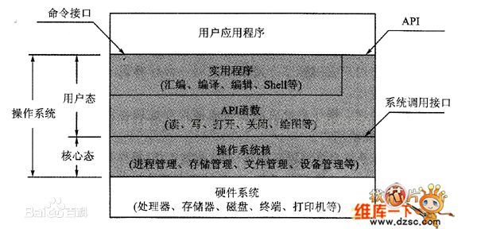

<!-- TOC -->

- [java基础](#java基础)
    - [java 语言基础](#java-语言基础)
        - [java自动拆装箱：](#java自动拆装箱)
        - [java 四种引用及其应用场景](#java-四种引用及其应用场景)
        - [foreach与正常for循环效率对比](#foreach与正常for循环效率对比)
        - [java反射的作用于原理](#java反射的作用于原理)
        - [java 动态代理](#java-动态代理)
- [数据库](#数据库)
    - [truncate与 delete区别](#truncate与-delete区别)
    - [B+树索引和哈希索引的区别](#b树索引和哈希索引的区别)
- [Linux](#linux)
    - [Top 查看系统信息](#top-查看系统信息)
    - [Linux 内核空间和用户空间](#linux-内核空间和用户空间)
- [分布式](#分布式)
    - [paxos 算法](#paxos-算法)

<!-- /TOC -->

# java基础

## java 语言基础

### java自动拆装箱：

自动装箱是将一个java定义的基本数据类型赋值给相应封装类的变量。 拆箱与装箱是相反的操作，自动拆箱则是将一个封装类的变量赋值给相应基本数据类型的变量。

### java 四种引用及其应用场景

1、强引用
最普遍的一种引用方式，如String s = "abc"，变量s就是字符串“abc”的强引用，只要强引用存在，则垃圾回收器就不会回收这个对象。

2、软引用（SoftReference）
用于描述还有用但非必须的对象，如果内存足够，不回收，如果内存不足，则回收。一般用于实现内存敏感的高速缓存，软引用可以和引用队列ReferenceQueue联合使用，如果软引用的对象被垃圾回收，JVM就会把这个软引用加入到与之关联的引用队列中。

3、弱引用（WeakReference）
弱引用和软引用大致相同，弱引用与软引用的区别在于：只具有弱引用的对象拥有更短暂的生命周期。在垃圾回收器线程扫描它所管辖的内存区域的过程中，一旦发现了只具有弱引用的对象，不管当前内存空间足够与否，都会回收它的内存。

4、虚引用（PhantomReference）
就是形同虚设，与其他几种引用都不同，虚引用并不会决定对象的生命周期。如果一个对象仅持有虚引用，那么它就和没有任何引用一样，在任何时候都可能被垃圾回收器回收。 虚引用主要用来跟踪对象被垃圾回收器回收的活动。

虚引用与软引用和弱引用的一个区别在于：
虚引用必须和引用队列 （ReferenceQueue）联合使用。当垃圾回收器准备回收一个对象时，如果发现它还有虚引，就会在回收对象的内存之前，把这个虚引用加入到与之关联的引用队列中。

### foreach与正常for循环效率对比

用for循环arrayList 10万次花费时间：5毫秒。
用foreach循环arrayList 10万次花费时间：7毫秒。
用for循环linkList 10万次花费时间：4481毫秒。
用foreach循环linkList 10万次花费时间：5毫秒。
循环ArrayList时，普通for循环比foreach循环花费的时间要少一点。
循环LinkList时，普通for循环比foreach循环花费的时间要多很多。
当我将循环次数提升到一百万次的时候，循环ArrayList，普通for循环还是比foreach要快一点；但是普通for循环在循环LinkList时，程序直接卡死。
ArrayList：ArrayList是采用数组的形式保存对象的，这种方式将对象放在连续的内存块中，所以插入和删除时比较麻烦，查询比较方便。
LinkList：LinkList是将对象放在独立的空间中，而且每个空间中还保存下一个空间的索引，也就是数据结构中的链表结构，插入和删除比较方便，但是查找很麻烦，要从第一个开始遍历。

结论：
**需要循环数组结构的数据时，建议使用普通for循环，因为for循环采用下标访问，对于数组结构的数据来说，采用下标访问比较好。
需要循环链表结构的数据时，一定不要使用普通for循环，这种做法很糟糕，数据量大的时候有可能会导致系统崩溃。**

链表：使用foreach
数组：使用for循环

### java反射的作用于原理

Java 反射是可以让我们在运行时，通过一个类的Class对象来获取它获取类的方法、属性、父类、接口等类的内部信息的机制。

这种动态获取信息以及动态调用对象的方法的功能称为JAVA的反射。

### java 动态代理

# 数据库

##  truncate与 delete区别

TRUNCATE TABLE 在功能上与不带 WHERE 子句的 DELETE 语句相同：二者均删除表中的全部行。但 TRUNCATE TABLE 比 DELETE 速度快，且使用的系统和事务日志资源少。 

DELETE 语句每次删除一行，并在事务日志中为所删除的每行记录一项。

TRUNCATE TABLE 通过释放存储表数据所用的数据页来删除数据，并且只在事务日志中记录页的释放。

TRUNCATE,DELETE,DROP 放在一起比较：

TRUNCATE TABLE ：删除内容、释放空间但不删除定义。
DELETE TABLE: 删除内容不删除定义，不释放空间。
DROP TABLE ：删除内容和定义，释放空间

## B+树索引和哈希索引的区别

B+树是一个平衡的多叉树，从根节点到每个叶子节点的高度差值不超过1，而且同层级的节点间有指针相互链接，是有序的

哈希索引就是采用一定的哈希算法，把键值换算成新的哈希值，检索时不需要类似B+树那样从根节点到叶子节点逐级查找，只需一次哈希算法即可立刻定位到相应的位置，速度非常快。是无序的

**优势对比：**

- 如果是等值查询，那么哈希索引明显有绝对优势，因为只需要经过一次算法即可找到相应的键值；当然了，这个前提是，键值都是唯一的。如果键值不是唯一的，就需要先找到该键所在位置，然后再根据链表往后扫描，直到找到相应的数据；

- 从示意图中也能看到，如果是范围查询检索，这时候哈希索引就毫无用武之地了，因为原先是有序的键值，经过哈希算法后，有可能变成不连续的了，就没办法再利用索引完成范围查询检索；

- 同理，哈希索引也没办法利用索引完成排序，以及like ‘xxx%’ 这样的部分模糊查询（这种部分模糊查询，其实本质上也是范围查询）；

- 哈希索引也不支持多列联合索引的最左匹配规则；

- B+树索引的关键字检索效率比较平均，不像B树那样波动幅度大，在有大量重复键值情况下，哈希索引的效率也是极低的，因为存在所谓的哈希碰撞问题。

说白了，等值查询的时候，Hash索引才有用武之地。

# Linux

## Top 查看系统信息

参考文档：
- [Linux top命令的用法详细详解](https://www.cnblogs.com/zhoug2020/p/6336453.html)

## Linux 内核空间和用户空间

通常32位Linux内核地址空间划分0~3G为用户空间，3~4G为内核空间。注意这里是32位内核地址空间划分，64位内核地址空间划分是不同的。

当内核模块代码或线程访问内存时，代码中的内存地址都为逻辑地址，而对应到真正的物理内存地址，需要地址一对一的映射，如逻辑地址0xc0000003对应的物理地址为0×3，0xc0000004对应的物理地址为0×4，… …，逻辑地址与物理地址对应的关系为

物理地址 = 逻辑地址 – 0xC0000000

处于用户态的程序只能访问用户空间，而处于内核态的程序可以访问用户空间和内核空间。那么用户态和内核态有什么区别呢？

当一个任务（进程）执行系统调用而陷入内核代码中执行时，我们就称进程处于内核运行态（或简称为内核态）。此时处理器处于特权级最高的（0级）内核代码中执行。当进程处于内核态时，执行的内核代码会使用当前进程的内核栈。每个进程都有自己的内核栈。当进程在执行用户自己的代码时，则称其处于用户运行态（用户态）。即此时处理器在特权级最低的（3级）用户代码中运行。

内核态与用户态是操作系统的两种运行级别,Intel x86架构提供Ring0-Ring3四种级别的运行模式，Ring0级别最高，Ring3最低。Linux使用了Ring3级别运行用户态，Ring0作为 内核态，没有使用Ring1和Ring2。Ring3状态不能访问Ring0的地址空间，包括代码和数据。程序特权级别的不同，其所拥有的权力也不同。如下图所示。

用户态切换到内核态的3种方式:

a. 系统调用

这是用户态进程主动要求切换到内核态的一种方式，用户态进程通过系统调用申请使用操作系统提供的服务程序完成工作，比如fork()实际上就是执行了一个创建新进程的系统调用。而系统调用的机制其核心还是使用了操作系统为用户特别开放的一个中断来实现，例如Linux的int 80h中断。

b. 异常

当CPU在执行运行在用户态下的程序时，发生了某些事先不可知的异常，这时会触发由当前运行进程切换到处理此异常的内核相关程序中，也就转到了内核态，比如缺页异常。

c. 外围设备的中断

当外围设备完成用户请求的操作后，会向CPU发出相应的中断信号，这时CPU会暂停执行下一条即将要执行的指令转而去执行与中断信号对应的处理程序，如果先前执行的指令是用户态下的程序，那么这个转换的过程自然也就发生了由用户态到内核态的切换。比如硬盘读写操作完成，系统会切换到硬盘读写的中断处理程序中执行后续操作等。

这3种方式是系统在运行时由用户态转到内核态的最主要方式，其中系统调用可以认为是用户进程主动发起的，异常和外围设备中断则是被动的。

参考链接：
- [linux 用户空间与内核空间——高端内存详解](https://www.cnblogs.com/wuchanming/p/4360277.html)
- [内核态(内核空间)和用户态(用户空间)的区别和联系](https://blog.csdn.net/qq_34228570/article/details/72995997)

# 分布式

## paxos 算法

[通俗易懂](https://www.cnblogs.com/endsock/p/3480093.html)

